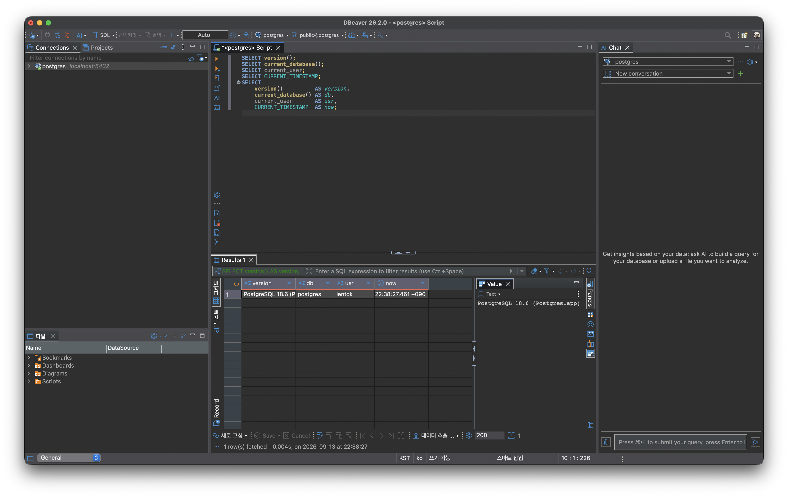
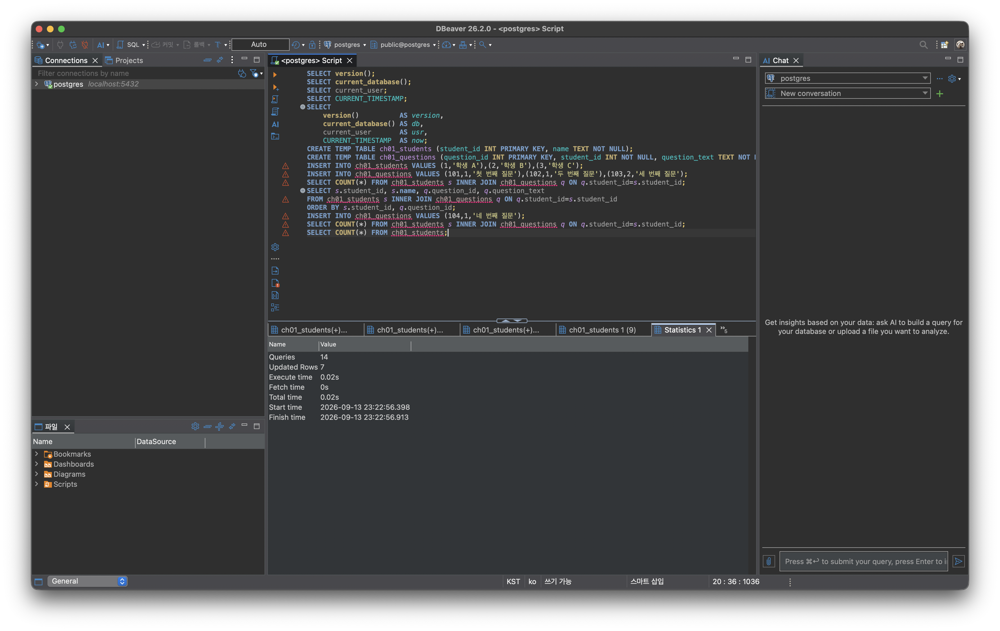
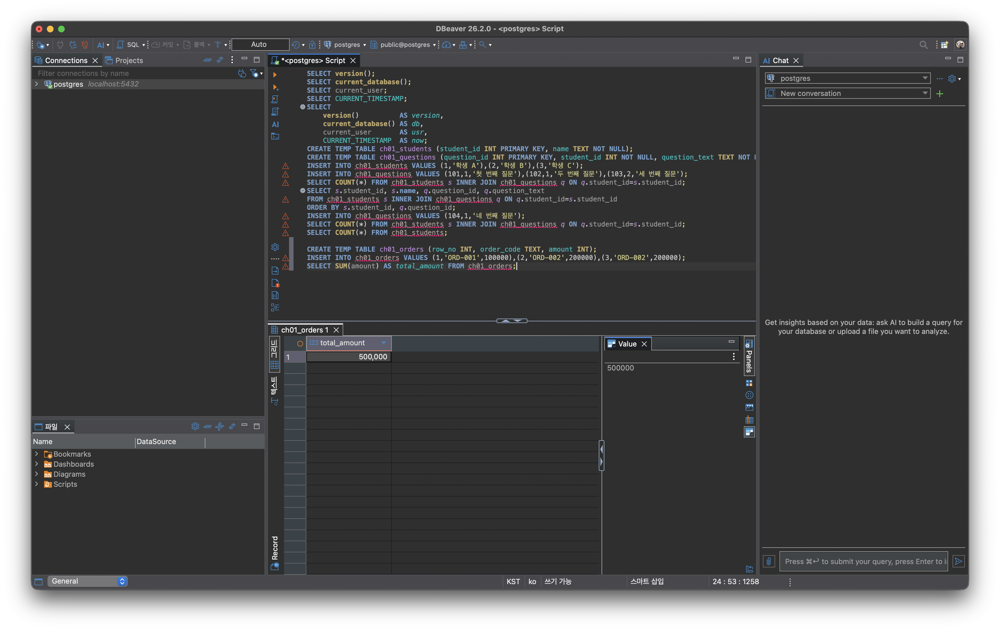
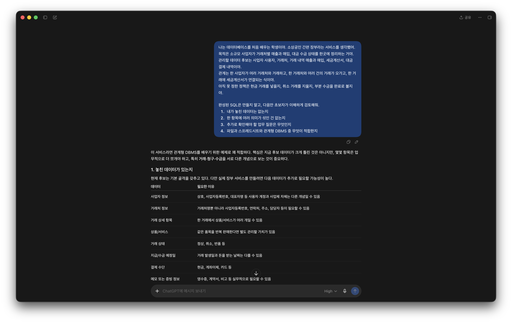

# Chapter 01 확장 실습 답안 템플릿

> **과제:** AI 시대에 데이터베이스를 왜 배워야 하는가  
> **사용 방법:** 이 파일을 내려받아 **본인의 GitHub 저장소**에 `chapter01_answer.md`라는 이름으로 저장한 뒤 답안을 작성합니다.  
> **제출 방법:** LMS에는 파일을 업로드하지 않고, **본인 GitHub 저장소의 `chapter01_answer.md` 파일 URL**을 제출합니다.

---

## 0. 학생 정보

| 항목 | 작성 내용 |
| --- | --- |
| 학번 | 2021-15472 |
| 이름 | 이진현 |
| GitHub 계정 | lentok-viva |
| 과제 작성일 | 2026-09-13 |
| 사용한 AI 도구 | ChatGPT |

> 실제 비밀번호, API Key, 전체 DB 접속 URL, 개인정보는 이 파일이나 캡처 화면에 기록하지 않습니다.

---

# 1. PostgreSQL 실행 환경 확인

## 1-1. 실행한 SQL

```sql
SELECT version();
SELECT current_database();
SELECT current_user;
SELECT CURRENT_TIMESTAMP;
```

## 1-2. 실행 결과 기록

```text
PostgreSQL 버전: PostgreSQL 18.6 (Postgres.app) on aarch64-apple-darwin23.6.0, compiled by Apple clang version 15.0.0 (clang-1500.3.9.4), 64-bit
현재 데이터베이스: postgres
현재 사용자: lentok
현재 시각: 2026-09-13 22:38:27.461 +0900
```

## 1-3. 내가 확인한 내용

1. SQL을 작성하는 프로그램과 PostgreSQL은 같은 프로그램인가요?

```text
나의 답: 아니다. PostgreSQL은 데이터를 실제로 저장하고 SQL을 실행하는 서버(엔진)이고, DBeaver는 그 서버에 SQL을 보내고 결과를 받아 보여주는 클라이언트(도구)다. 둘은 별개 프로그램이라 DBeaver를 꺼도 서버는 계속 돌고, psql 같은 다른 도구로도 같은 서버에 접속할 수 있다.
```

2. `current_database()` 결과는 무엇을 의미하나요?

```text
나의 답: 지금 내 연결이 접속해 있는 데이터베이스의 이름(현재 postgres)이다. 한 서버 안에는 여러 데이터베이스가 있을 수 있고, 그중 지금 SQL이 실행되는 대상 DB가 무엇인지를 알려준다.
```

3. SQL이 실행되었다는 사실만으로 데이터 내용도 올바르다고 할 수 있나요?

```text
나의 답: 아니다. SQL이 문법 오류 없이 실행된 것과, 그 결과 값이 업무적으로 올바른 것은 별개다. 데이터가 잘못됐거나 요구사항과 SQL이 어긋나면 실행이 성공해도 결과는 틀릴 수 있다.
```

## 1-4. 증거 화면

아래 경로에 캡처 이미지를 저장하는 것을 권장합니다.

```text
assignments/chapter01/images/step01_environment.png
```

이미지를 저장했다면 아래 링크의 파일명을 실제 파일명에 맞게 수정합니다.

```markdown

```

**이미지 삽입 위치:**

<!-- 아래 줄의 주석을 지우고 실제 이미지 Markdown을 넣어도 됩니다. -->


---

# 2. Chapter 01 핵심 내용 복습

교재 문장을 그대로 복사하지 말고 자신의 말로 작성합니다.

| 본문의 핵심 | 나의 설명 |
| --- | --- |
| AI가 SQL을 만들어도 DB를 배워야 한다 | AI는 그럴듯한 SQL을 만들지만, 그게 내 데이터·요구사항에 맞는지와 결과가 옳은지는 사람이 판단·검증해야 하므로 DB 구조와 원리를 알아야 한다. |
| 데이터 구조가 중요하다 | 같은 값이라도 테이블을 어떻게 나누고 연결(관계)하느냐에 따라 조회·집계 결과와 정확성이 달라진다. |
| SQL 결과를 검증해야 한다 | 실행 성공과 정답은 다르므로, 결과를 예상값·실제 데이터와 대조해 확인해야 한다. |
| 데이터 품질이 AI 답변 품질에 영향을 준다 | 입력 데이터에 중복·누락·오류가 있으면 AI 분석도 그 오류를 그대로 반영해 틀린 결론을 낸다(garbage in, garbage out). |
| 저장 방식은 데이터 양만 보고 선택하지 않는다 | 파일·스프레드시트·DBMS 선택은 데이터 양뿐 아니라 관계·동시 수정·정확성·변경 이력·권한·지속 사용 등을 함께 고려해야 한다. |

## 가장 중요하다고 생각한 한 문장

```text
SQL이 실행됐다는 것과 결과가 올바른 것은 다르므로, 데이터의 의미와 결과는 결국 사람이 검증해야 한다.
```

---

# 3. 실행 성공과 결과 정확성의 차이

## 3-1. SQL 실행 전 예상

학생 A는 질문 2개, 학생 B는 질문 1개, 학생 C는 질문이 없습니다.

```text
전체 학생 수: 3 명
전체 질문 수: 3 개
질문이 있는 학생 수: 2 명
질문이 없는 학생 수: 1 명
```

## 3-2. 임시 테이블 생성 및 데이터 입력 완료 확인

- [x] `ch01_students` 생성
- [x] `ch01_questions` 생성
- [x] 학생 3명 입력
- [x] 질문 3건 입력
- [x] 두 테이블의 데이터를 직접 조회

## 3-3. 잘못된 학생 수 SQL 실행 결과

실행한 SQL:

```sql
SELECT COUNT(*) AS student_count
FROM ch01_students AS s
INNER JOIN ch01_questions AS q
    ON q.student_id = s.student_id;
```

실행 결과:

```text
3
```

## 3-4. JOIN 상세 결과 관찰

```text
학생 A가 나타난 행 수: 2
학생 B가 나타난 행 수: 1
학생 C가 나타난 행 수: 0
```

다음 질문에 답합니다.

### Q1. 학생 C가 왜 결과에서 사라졌나요?

```text
C는 질문을 하나도 안 해서 questions 쪽에 매칭될 게 없었다. INNER JOIN은 양쪽에 다 있는 것만 남기니까 C는 그냥 빠져버렸다.
```

### Q2. 학생 A가 왜 여러 행으로 나타났나요?

```text
A는 질문이 101번, 102번 이렇게 2개라서 조인하니까 질문마다 한 줄씩 붙어서 2줄이 됐다.
```

### Q3. 위 `COUNT(*)`가 실제로 세고 있었던 것은 무엇인가요?

```text
학생 수를 센 게 아니라, 사실은 조인돼서 나온 줄 수를 세고 있었다. 즉 질문이 있는 학생들의 질문 개수를 다 더한 값이다.
```

### Q4. 결과 숫자가 우연히 실제 학생 수와 같아도 바로 믿으면 안 되는 이유는 무엇인가요?

```text
지금은 어쩌다 3으로 학생 수랑 똑같이 나왔을 뿐, 실제로 세는 대상은 다르다. 데이터가 조금만 바뀌어도 숫자가 어긋나니까, 숫자가 맞아 보여도 이게 대체 뭘 세고 있는 건지부터 확인해야 한다.
```

## 3-5. 질문 한 건을 추가한 뒤 다시 실행

추가한 데이터:

```text
INSERT INTO ch01_questions VALUES (104, 1, '네 번째 질문');
```

다시 실행한 결과:

```text
AI SQL 결과: 4
실제 학생 수: 3
```

### 결과 해석

```text
데이터가 바뀐 뒤 무엇이 달라졌는지: 질문을 하나 추가했더니 조인 COUNT가 3에서 4로 늘었다.

실제 학생 수는 왜 그대로인지: 학생은 안 늘리고 질문만 하나 넣었으니까. 조인 줄 수는 질문 수를 따라 움직인다.

이 실험을 통해 알게 된 점: 역시 그 COUNT는 학생이 아니라 질문, 그러니까 조인돼서 늘어난 줄을 세고 있었다. 진짜 학생 수가 궁금하면 학생 테이블을 바로 세면 된다.
```

## 3-6. 학생 테이블을 직접 센 결과

```sql
SELECT COUNT(*) AS student_count
FROM ch01_students;
```

결과:

```text
3
```

### 두 SQL의 차이를 내 말로 설명

```text
첫 번째 SQL은 질문이 있는 학생들의 질문이 붙은 조인 줄 수를 세고 있었다.

두 번째 SQL은 학생 테이블에 실제로 있는 학생 수를 세고 있었다.

따라서 SQL을 검토할 때는 문법보다 먼저 이 쿼리가 도대체 뭘 세고 있는지를 확인해야 한다.
```

## 3-7. 증거 화면

권장 경로:

```text
assignments/chapter01/images/step03_join_result.png
```



---

# 4. 잘못된 데이터가 결과를 바꾸는 과정

## 4-1. 주문 데이터 확인

다음 데이터를 입력한 뒤 실제 결과를 확인합니다.

```text
ORD-001, 100000
ORD-002, 200000
ORD-002, 200000
```

## 4-2. 실행 전 예상

업무적으로 주문이 `ORD-001`, `ORD-002` 두 건이고 `order_code`가 주문을 고유하게 구분한다고 **가정할 경우** 예상 합계:

```text
300000 원
```

> 위 가정 자체가 실제 업무 규칙인지 확인해야 한다는 점도 기억합니다.

## 4-3. SQL 합계

```sql
SELECT SUM(amount) AS total_amount
FROM ch01_orders;
```

실제 결과:

```text
500000 원
```

## 4-4. 결과 해석

### `SUM` 문법 자체가 잘못된 것인가요?

```text
아니다. 문법은 맞다. SQL은 그냥 시킨 대로 금액을 다 더했을 뿐이다.
```

### 결과 차이의 원인은 무엇인가요?

```text
ORD-002가 똑같이 두 줄 들어가 있어서 20만 원이 두 번 더해졌다. 그래서 예상한 30만 원이 아니라 50만 원이 나왔다.
```

### SQL이 정확하게 실행되어도 업무 숫자가 잘못될 수 있는 이유를 설명하세요.

```text
데이터 자체가 잘못돼 있으면 SQL은 그걸 그대로 다 더하기 때문이다. 실행은 잘 돼도 실제 업무랑 안 맞는 숫자가 나올 수 있다.
```

## 4-5. AI에게 같은 데이터를 분석시킨 결과

AI가 계산한 합계:

```text
500000원이라고 나왔다.
```

AI가 중복 가능성을 언급했나요?

```text
그냥 합계만 물으면 500000원이라고만 답할 때가 많았다. 같은 주문번호가 두 번 있는데 이거 중복 아니냐고 짚어줘야 그제서야 중복일 수도 있다고 말해줬다.
```

AI가 `ORD-002` 두 행이 실제 두 주문인지 중복 입력인지 스스로 확정할 수 있나요? 이유도 적으세요.

```text
확정 못 한다. 데이터만 봐서는 원래 두 번 주문한 건지 실수로 두 번 들어간 건지 알 수가 없다. 그건 실제 업무 규칙을 아는 사람만 판단할 수 있다.
```

추가로 확인해야 할 업무 규칙:

```text
1. 주문번호가 주문 하나를 딱 하나로 구분하는 값인지
2. 같은 주문번호가 두 번 들어오는 게 허용되는 건지 아니면 실수인지
3. 합계를 낼 때 중복은 빼고 계산해야 하는지
```

내가 최종적으로 내린 판단:

```text
지금 데이터만으로는 50만 원이 맞다고 할 수 없다. ORD-002가 중복인지부터 확인해야 하고, 중복이라면 30만 원이 맞는 합계다.
```

## 4-6. 증거 화면

권장 경로:

```text
assignments/chapter01/images/step04_duplicate_result.png
```



---

# 5. 파일·스프레드시트·DBMS 선택 연습

각 사례에 대해 **AI에게 묻기 전에 먼저 본인의 판단을 작성**합니다.

## 사례 A. 개인 독서 기록

```text
나의 선택: 스프레드시트
선택 이유: 나 혼자 쓰고 한 달에 몇 건 안 되고 관계나 권한도 필요 없어서 엑셀 같은 표로도 충분하다.
어떤 조건이 추가되면 다른 방식으로 바꿀 것인지: 여러 사람이 같이 기록하거나 책과 저자 대출 같은 관계가 생기고 데이터가 많이 쌓이면 DBMS로 옮기는 게 낫다.
```

## 사례 B. 동아리 행사 신청 명단

```text
나의 선택: 스프레드시트
선택 이유: 운영진 몇 명이 잠깐 쓰는 거라 같이 볼 수 있는 공유 스프레드시트로 충분하다. 이름 연락처 참석 여부를 정리하고 참석률도 계산할 수 있다.
어떤 조건이 추가되면 다른 방식으로 바꿀 것인지: 신청이 아주 많아지거나 여러 명이 동시에 고치다 서로 덮어쓰는 일이 생기고 매년 반복해서 관리해야 하면 DBMS가 낫다.
```

## 사례 C. 온라인 강의 서비스

```text
나의 선택: DBMS
선택 이유: 학생과 강의가 여러 대 여러로 얽히고 신청 상태가 계속 바뀌고 여러 사람이 동시에 쓰고 권한이랑 복구도 중요해서 스프레드시트로는 감당이 안 된다.
어떤 조건이 추가되면 다른 방식으로 바꿀 것인지: 반대로 사용자도 나 혼자고 데이터도 몇 개뿐이고 관계도 없다면 그때는 스프레드시트로도 된다.
```

## 판단 기준 체크

- [x] 데이터 증가
- [x] 여러 사용자의 동시 수정
- [x] 데이터 사이의 관계
- [x] 반복 조회와 집계
- [x] 정확성·일관성
- [x] 변경 이력
- [x] 권한 구분
- [x] 백업·복구
- [x] 웹·앱에서 지속 사용

### 데이터가 적으면 무조건 스프레드시트를 사용해야 하나요?

```text
나의 답: 아니다. 데이터가 적어도 여러 사람이 동시에 고치거나 데이터끼리 관계가 있거나 정확성과 권한 변경 이력이 중요하면 DBMS가 낫다. 양만 보고 정하면 안 된다.
```

---

# 6. 나만의 서비스 데이터 구조 초안

> 이 내용은 이후 Chapter에서 계속 확장할 수 있으므로 신중하게 작성합니다.

## 6-1. 서비스 정의

```text
서비스 이름: 소상공인 간편 장부

이 서비스는
소규모 사업자가 거래처별 매출과 매입, 대금 수금 상태를 한곳에 정리하고 세무 신고 준비를 돕기
위한 서비스이다.
```

## 6-2. 관리할 데이터 후보

```text
1. 사업자 사용자
2. 거래처
3. 거래 내역 매출과 매입
4. 세금계산서
5. 대금 결제 내역
```

## 6-3. 한 행의 의미

| 데이터 후보 | 한 행의 의미 |
| --- | --- |
| 거래처 | 거래를 주고받는 상대 한 곳 |
| 거래 내역 | 매출이나 매입 한 건 |
| 세금계산서 | 발행했거나 받은 세금계산서 한 장 |
| 대금 결제 내역 | 대금을 한 번 주고받은 기록 |

## 6-4. 관계를 자연어로 설명

```text
1. 한 사업자는 여러 거래처와 거래할 수 있다.
2. 한 거래처와는 여러 건의 거래가 오간다.
3. 하나의 거래에는 보통 세금계산서 한 장이 연결된다.
4. 한 거래의 대금은 여러 번에 나눠서 결제될 수 있다.
```

## 6-5. 아직 결정하지 않은 정책

```text
Q1. 세금계산서 없이 현금으로만 거래한 건도 장부에 넣을지
Q2. 거래를 취소하거나 반품하면 원래 기록을 지울지 아니면 취소 표시만 남길지
Q3. 대금이 일부만 들어온 건을 완료로 볼지 미수로 볼지
```

> 확정되지 않은 정책을 AI가 임의로 결정한 경우 그대로 받아들이지 않습니다.

---

# 7. AI를 검토자로 활용하기

## 7-1. 내가 AI에게 전달한 핵심 프롬프트

개인정보나 비밀번호 등 민감한 내용은 제거한 뒤 기록합니다.

```text
나는 데이터베이스를 처음 배우는 학생이야. 소상공인 간편 장부라는 서비스를 생각했어.
목적은 소규모 사업자가 거래처별 매출과 매입, 대금 수금 상태를 한곳에 정리하는 거야.
관리할 데이터 후보는 사업자 사용자, 거래처, 거래 내역 매출과 매입, 세금계산서, 대금 결제 내역이야.
관계는 한 사업자가 여러 거래처와 거래하고, 한 거래처와 여러 건의 거래가 오가고, 한 거래에 세금계산서가 연결되는 식이야.
아직 못 정한 정책은 현금 거래를 넣을지, 취소 거래를 지울지, 부분 수금을 완료로 볼지야.
완성된 SQL은 만들지 말고, 내가 놓친 데이터는 없는지, 한 항목에 여러 의미가 섞인 건 없는지, 추가로 확인해야 할 업무 질문은 무엇인지, 파일과 스프레드시트와 관계형 DBMS 중 무엇이 적합한지 초보자가 이해하게 검토해줘. 확정 안 된 정책은 네가 임의로 정하지 말고 확인이 필요하다고 표시만 해줘.
```

## 7-2. AI의 주요 제안과 나의 판단

최소 5개를 작성합니다.

| AI의 제안 | 수용 / 수정 / 거절 | 나의 판단 근거 |
| --- | --- | --- |
| 매출과 매입을 따로 만들지 말고 거래에 거래유형을 두어 하나로 묶어라 | 수용 | 매출과 매입은 구조가 거의 같아서 하나로 묶고 유형만 구분하는 게 자연스럽다 |
| 수금 상태를 완료 미완료 한 값으로 두지 말고 결제 내역을 따로 기록해 합계로 상태를 판단하라 | 수용 | 부분 수금이 있으면 한 값으로는 부족하다. 거래 한 건에 결제가 여러 건 붙을 수 있다 |
| 거래와 세금계산서를 1대1로 가정하지 말라 | 수용 | 여러 거래에 계산서 한 장이거나 수정 계산서가 나오는 경우가 있다 |
| 거래처에 매출처 매입처를 고정 속성으로 넣지 말라 | 수용 | 한 거래처가 매출처이면서 동시에 매입처일 수 있다 |
| 사용자와 사업자를 구분하라 | 수용 | 사장 직원 세무대리인이 한 사업자를 함께 볼 수 있다 |
| 한 거래에 품목이 여러 개면 거래와 거래 상세를 나눠라 | 수용 | 노트북과 모니터처럼 한 거래에 품목이 여러 개일 수 있다 |
| 상품을 별도 표로 관리하라 | 수정 | 같은 품목을 반복 판매할 때만 도입하고 지금은 나중으로 미뤘다 |
| 학습용이면 사업자 거래처 거래 결제만 먼저 잡고 나머지는 확장하라 | 수용 | 처음부터 다 넣으면 복잡해서 핵심만 먼저 만들기로 했다 |

## 7-3. AI에게 자기 답변을 다시 비판하도록 요청한 결과

첫 번째 답변과 달라진 점:

```text
AI가 한 답 안에서도 이건 무조건 정답이 아니라거나 세금계산서를 1대1로 가정하지 않는 게 안전하다는 식으로 스스로 단정을 피하고 확인이 필요하다고 표시해줬다.
```

AI가 처음에 임의로 가정했던 내용:

```text
한 거래에 세금계산서가 한 장이라는 내 전제, 그리고 매출과 매입을 따로 봐야 한다는 생각을 다시 짚어줬다.
```

추가로 업무 담당자에게 확인해야 한다고 판단한 내용:

```text
거래의 정의가 견적이나 주문까지인지, 부분 수금과 외상 거래를 허용하는지, 취소를 삭제할지 상태로 남길지.
```

## 7-4. AI 활용에 대한 나의 평가

```text
가장 유용했던 부분: 거래와 돈의 이동을 다른 사건으로 봐야 한다는 점. 거래 한 건에 결제가 여러 건 붙는 구조를 알려준 것.

수정하거나 거절한 부분: 상품 표를 지금 당장 만들자는 건 미뤘고, 처음부터 모든 데이터를 넣지는 않기로 했다.

그렇게 판단한 근거: 지금 규모에서는 핵심만 먼저 잡는 게 낫고, 품목이 반복되지 않으면 표를 늘릴 필요가 없어서다.

AI가 없었다면 놓쳤을 가능성이 있는 질문: 수금 상태를 한 값으로 두면 부분 수금을 못 담는다는 점, 세금계산서가 거래와 항상 1대1은 아니라는 점.
```

## 7-5. AI 활용 증거 화면

권장 경로:

```text
assignments/chapter01/images/step07_ai_review.png
```

AI 대화 전체를 캡처할 필요는 없습니다. 핵심 요청과 검토 과정이 보이는 화면 1장 정도면 충분합니다.



---

# 8. 기준 데이터·파생 데이터·AI 생성 결과 구분

내 서비스에 맞게 작성합니다.

| 구분 | 내 서비스의 예 | 판단 이유 |
| --- | --- | --- |
| 기준 데이터 | 거래처, 실제로 일어난 거래, 결제 내역 | 실제로 발생한 원본 사실이라 다른 값들의 근거가 되기 때문 |
| 파생 데이터 | 미수금, 월별 매출 합계, 부가세 합계 | 기준 데이터를 계산하거나 집계해서 나온 값이라 원본이 바뀌면 다시 계산해야 함 |
| AI 생성 결과 | ChatGPT가 정리해준 이번 달 매출 요약이나 설계 제안 | 데이터와 내 지시로 만들어진 결과라 사람이 검증해야 함 |

### 기준 데이터가 변경되면 파생 데이터는 어떻게 해야 하나요?

```text
다시 계산해서 갱신해야 한다. 안 그러면 원본과 안 맞는 옛날 숫자가 그대로 남는다. 예를 들어 거래 금액이 바뀌면 미수금과 월 합계도 다시 뽑아야 맞다.
```

### AI 결과만 있고 원본 데이터가 없다면 결과를 충분히 검증할 수 있나요?

```text
못 한다. 원본 데이터가 있어야 AI가 낸 숫자가 맞는지 대조해볼 수 있다. 원본 없이 AI 요약만 있으면 틀렸는지 맞았는지 확인할 방법이 없다.
```

---

# 9. 최종 성찰

아래 세 문장은 반드시 **본인의 말**로 작성합니다.

```text
1. SQL이 실행되어도 결과를 바로 믿으면 안 되는 이유는
   실행이 됐다는 것과 그 숫자가 실제 업무에 맞다는 것은 서로 다른 문제이기 때문 이다.

2. AI를 데이터베이스 학습에 활용할 때 가장 중요한 것은
   AI 답을 정답으로 받지 말고 내가 데이터와 결과로 직접 검증하는 것 이다.

3. 이번 실습 이후 내가 더 확인하고 싶은 것은
   거래 한 건에 결제 여러 건 같은 관계를 실제 테이블과 키로 어떻게 설계하는지 이다.
```

## 이번 Chapter에서 새롭게 알게 된 점 3가지

```text
1. INNER JOIN은 양쪽에 다 있는 것만 남겨서, 한쪽에 없는 데이터는 빠지고 한쪽이 여러 개면 줄이 늘어난다.
2. 같은 숫자라도 무엇을 세는지에 따라 의미가 완전히 다를 수 있다.
3. 데이터에 중복이 있으면 SQL은 그대로 다 더해서 합계가 실제와 달라질 수 있다.
```

## 아직 이해가 명확하지 않은 부분

```text
1. 기본키와 외래키로 표들을 실제로 어떻게 연결하는지.
2. 거래 한 건에 결제 여러 건 같은 관계를 테이블로 어떻게 나누는지.
```

---

# 10. 제출 전 자기 점검

- [x] PostgreSQL 실행 화면을 확인했다.
- [x] SQL 실행 전에 예상 결과를 먼저 작성했다.
- [x] `INNER JOIN` 예제에서 누락과 반복을 설명할 수 있다.
- [x] 숫자가 우연히 같아도 의미가 다를 수 있음을 설명했다.
- [x] 중복 데이터가 집계 결과에 미치는 영향을 확인했다.
- [x] 저장 방식을 데이터 양만으로 판단하지 않았다.
- [x] 개인 서비스 주제를 하나 정했다.
- [x] 데이터 후보와 한 행의 의미를 작성했다.
- [x] 미확정 정책을 최소 3개 작성했다.
- [x] AI 제안을 수용·수정·거절로 구분했다.
- [x] AI 제안에 대한 판단 근거를 작성했다.
- [x] 기준 데이터·파생 데이터·AI 결과를 구분했다.
- [x] 핵심 증거 이미지가 Markdown에서 정상적으로 보인다.
- [x] 비밀번호·API Key·개인정보가 노출되지 않았다.

---

# 11. LMS 제출 정보

## 내 GitHub 답안 파일 URL

아래에는 **교수자 템플릿 URL이 아니라 본인이 작성한 답안 파일의 GitHub URL**을 기록합니다.

```text
https://github.com/<본인-GitHub-ID>/<본인-저장소>/blob/main/assignments/chapter01/chapter01_answer.md
```

내 실제 제출 URL:

```text
https://github.com/lentok-viva/database-course-2026-2/blob/main/assignments/chapter01/chapter01_answer.md
```

> LMS에는 위 **본인 저장소의 `chapter01_answer.md` 파일 URL 하나**를 제출합니다.

---

## 권장 학생 저장소 구조

```text
<본인-저장소>/
└── assignments/
    └── chapter01/
        ├── chapter01_answer.md
        └── images/
            ├── step01_environment.png
            ├── step03_join_result.png
            ├── step04_duplicate_result.png
            └── step07_ai_review.png
```

이 구조를 사용하면 이후 Chapter 02, Chapter 03도 같은 방식으로 계속 추가할 수 있습니다.
