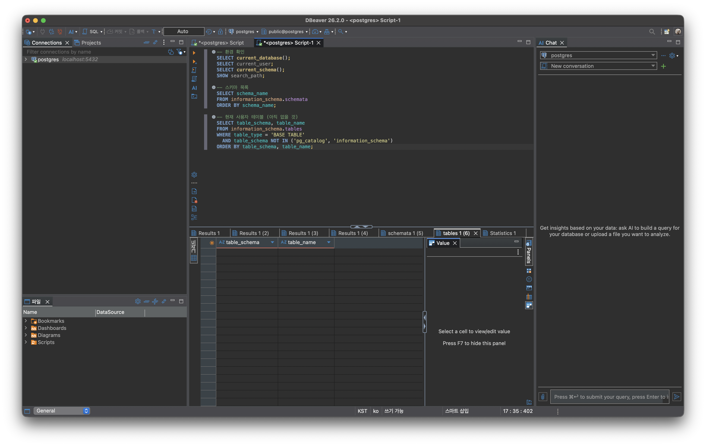
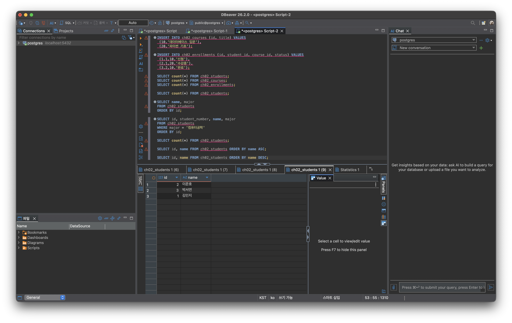
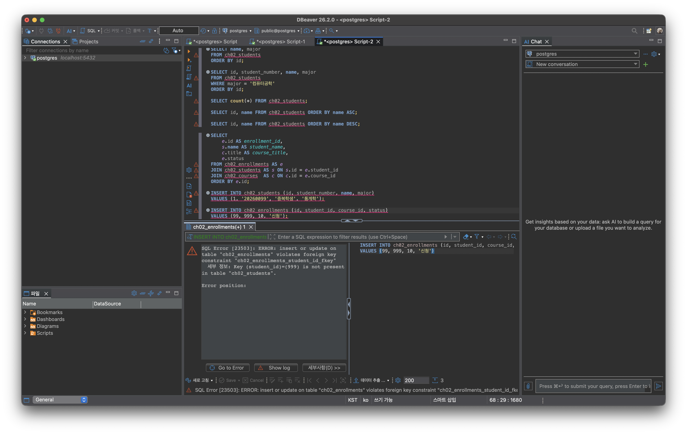
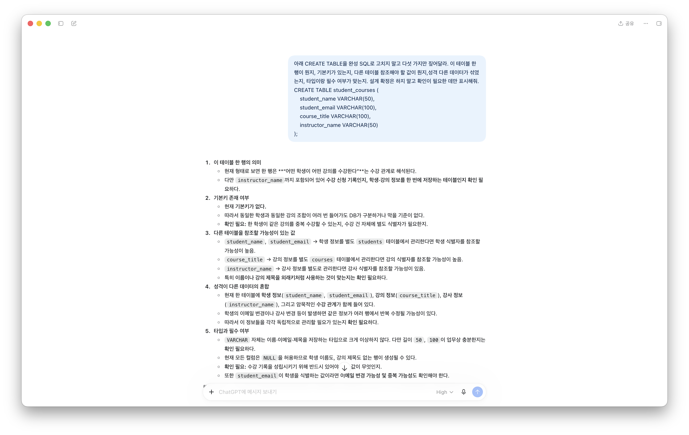

# Chapter 02 확장 실습 답안

> 과제: 데이터와 DBMS의 기본 개념
> 사용 방법: 이 파일을 본인 GitHub 저장소에 chapter02_answer.md로 저장하고 실습하면서 작성.
> 제출 방법: LMS에는 본인 GitHub 저장소의 chapter02_answer.md 파일 URL을 제출.

---

## 0. 학생 정보

| 항목 | 작성 내용 |
| --- | --- |
| 학번 | 2021-15472 |
| 이름 | 이진현 |
| GitHub 계정 | lentok-viva |
| 과제 작성일 | 2026-09-15 |
| 사용한 AI 도구 | ChatGPT, Claude |

> 실제 비밀번호, API Key, 전체 DB 접속 URL, 개인정보는 이 파일이나 캡처 화면에 안 넣는다.

---

# 1. PostgreSQL에서 현재 위치 확인

## 1-1. 실행한 SQL

```sql
SELECT version();
SELECT current_database();
SELECT current_user;
SELECT current_schema();
SHOW search_path;
```

## 1-2. 실행 결과 기록

```text
PostgreSQL 버전: PostgreSQL 18.6 (Postgres.app) on aarch64-apple-darwin23.6.0, 64-bit
현재 데이터베이스: postgres
현재 사용자: lentok
현재 스키마: public
search_path: "$user", public
```

## 1-3. 구조를 내 말로 설명

```text
PostgreSQL은: 데이터를 진짜로 저장하고 내가 보낸 SQL을 실행하는 서버다. 지금 내 맥에서 돌고 있다.
현재 접속한 데이터베이스는: postgres다. 설치하면 기본으로 생기는 DB라서 지금은 여기 붙어 있다.
스키마는: 데이터베이스 안에서 테이블 같은 걸 이름으로 나눠 담는 공간이고 지금은 public이다.
DBeaver 같은 도구는: 서버가 아니라 서버에 SQL을 보내고 결과를 받아 보여주는 프로그램이다. 꺼도 서버랑 데이터는 그대로 있다.
```

## 1-4. 계층 구조 완성

```text
사용자
→ DBeaver 같은 클라이언트
→ PostgreSQL DBMS
→ 데이터베이스
→ 스키마
→ 테이블
→ 행 / 열
```

## 1-5. 증거 화면

권장 경로:

```text
assignments/chapter02/images/step01_environment.png
```



---

# 2. 데이터베이스 안의 스키마와 테이블 관찰

## 2-1. 스키마 조회 결과

실행한 SQL:

```sql
SELECT schema_name
FROM information_schema.schemata
ORDER BY schema_name;
```

나온 스키마:

```text
information_schema
pg_catalog
pg_temp_10
pg_temp_6
pg_temp_9
pg_toast
pg_toast_temp_10
pg_toast_temp_6
pg_toast_temp_9
public
```

pg_temp_랑 pg_toast_temp_ 붙은 건 임시 테이블 쓰면 세션마다 생기는 임시 스키마인 것 같고 앞에서 실습하면서 만든 게 남아 보인다. 내가 직접 쓰는 건 public이다.

관찰한 스키마 3개:

```text
1. public
2. pg_catalog
3. information_schema
```

### public은 무엇인가요?

```text
데이터베이스를 만들면 기본으로 생기는 스키마다. 내가 스키마 이름 안 붙이고 테이블을 만들면 보통 여기에 들어간다.
```

### 데이터베이스와 스키마는 같은 것인가요?

```text
아니다. 데이터베이스가 더 큰 통이고 그 안에 스키마가 들어간다. 서버 안에 데이터베이스가 여러 개, 데이터베이스 안에 스키마가 여러 개, 스키마 안에 테이블이 들어가는 것이다.
```

## 2-2. 현재 보이는 테이블 조회

```sql
SELECT table_schema, table_name
FROM information_schema.tables
WHERE table_type = 'BASE TABLE'
  AND table_schema NOT IN ('pg_catalog', 'information_schema')
ORDER BY table_schema, table_name;
```

```text
조회된 사용자 테이블 수: 0개
괜찮은 이유: 지금은 기본 postgres DB에 접속만 한 상태고, 수업용 테이블은 뒤 장에서 만든다.
```

## 2-3. 관찰 정리

```text
PostgreSQL 서버 안에는 여러 데이터베이스가 있을 수 있다.
한 데이터베이스 안에는 여러 스키마가 있을 수 있다.
스키마 안에는 테이블 같은 데이터베이스 객체가 존재한다.
```

---

# 3. TEMP TABLE로 테이블, 행, 열, 키 직접 확인

실행한 SQL:

```sql
CREATE TEMP TABLE ch02_students (
    id             INT PRIMARY KEY,
    student_number VARCHAR(20) NOT NULL,
    name           VARCHAR(50) NOT NULL,
    major          VARCHAR(50)
);

CREATE TEMP TABLE ch02_courses (
    id    INT PRIMARY KEY,
    title VARCHAR(100) NOT NULL
);

CREATE TEMP TABLE ch02_enrollments (
    id         INT PRIMARY KEY,
    student_id INT NOT NULL REFERENCES ch02_students(id),
    course_id  INT NOT NULL REFERENCES ch02_courses(id),
    status     VARCHAR(20) NOT NULL
);

INSERT INTO ch02_students (id, student_number, name, major) VALUES
 (1,'20260001','김민지','컴퓨터공학'),
 (2,'20260002','이준호','데이터사이언스'),
 (3,'20260003','박서연','경영학');

INSERT INTO ch02_courses (id, title) VALUES
 (10,'데이터베이스 입문'),
 (20,'파이썬 기초');

INSERT INTO ch02_enrollments (id, student_id, course_id, status) VALUES
 (1,1,10,'신청'),
 (2,1,20,'수강중'),
 (3,2,10,'완료');
```

student_id랑 course_id에 REFERENCES를 걸어야 5번에서 없는 학생 참조 오류를 볼 수 있어서 그렇게 만들었다.

## 3-1. 임시 테이블 생성 완료 확인

- [x] ch02_students 생성
- [x] ch02_courses 생성
- [x] ch02_enrollments 생성

| 테이블 | 한 행의 의미 |
| --- | --- |
| ch02_students | 학생 한 명 |
| ch02_courses | 강의 한 개 |
| ch02_enrollments | 수강신청 한 건 |

## 3-2. 열의 의미 확인

ch02_students

| 열 | 값의 의미 | 내부 식별자 / 업무 식별자 / 일반 속성 |
| --- | --- | --- |
| id | DB 안에서 학생을 구분하는 번호 | 내부 식별자 |
| student_number | 학교에서 쓰는 학번 | 업무 식별자 |
| name | 학생 이름 | 일반 속성 |
| major | 전공 | 일반 속성 |

ch02_enrollments

| 열 | 값의 의미 | PK / FK / 일반 속성 |
| --- | --- | --- |
| id | 수강신청을 구분하는 번호 | PK |
| student_id | 신청한 학생 | FK |
| course_id | 신청한 강의 | FK |
| status | 신청, 수강중 같은 상태 | 일반 속성 |

## 3-3. 입력된 행 수

확인 SQL:

```sql
SELECT count(*) FROM ch02_students;
SELECT count(*) FROM ch02_courses;
SELECT count(*) FROM ch02_enrollments;
```

```text
students 행 수: 3
courses 행 수: 2
enrollments 행 수: 3
```

## 3-4. 내부 식별자와 업무 식별자

```text
students.id가 필요한 이유: DB 안에서 학생을 안 흔들리게 구분하려고. 다른 테이블에서 학생을 가리킬 때도 이 id를 쓰면 편하다.
student_number가 필요한 이유: 사람이 실제로 보고 쓰는 건 학번이라서. 업무에서 학생을 알아보는 값은 따로 있어야 한다.
둘을 항상 같은 값으로 안 써도 되는 이유: 목적이 다르기 때문이다. id는 안 바뀌게 내부에서 구분하는 값이고 학번은 학교 정책이 바뀌면 형식이 바뀔 수도 있는 값이라서, 학번이 바뀌어도 id는 그대로 두면 된다.
```

## 3-5. 숫자처럼 보이는 학번을 문자열로 저장한 이유

```text
학번은 더하거나 곱하는 값이 아니고 앞에 0이 붙는 경우도 있어서 숫자로 저장하면 0이 날아간다. 그래서 계산 안 하고 그냥 이름표 같은 값은 문자열로 저장하는 게 안전하다.
```

---

# 4. 테이블과 조회 결과는 다르다

## 4-1. 원본 테이블 행 수

```sql
SELECT count(*) FROM ch02_students;
```

```text
ch02_students 전체 행 수: 3
```

## 4-2. 일부 열만 조회

```sql
SELECT name, major
FROM ch02_students
ORDER BY id;
```

결과:

```text
name   | major
김민지 | 컴퓨터공학
이준호 | 데이터사이언스
박서연 | 경영학
```

```text
열 수가 다른 이유: 원본은 id, student_number, name, major 이렇게 4개인데 조회할 때 name이랑 major 두 개만 골라서 그렇다. 조회 결과는 원본을 그대로 보여주는 게 아니라 선택한 열만 뽑아서 만든 것이고 원본 테이블은 그대로 있다.
```

## 4-3. 조건을 적용한 조회

```sql
SELECT id, student_number, name, major
FROM ch02_students
WHERE major = '컴퓨터공학'
ORDER BY id;
```

결과:

```text
id | student_number | name   | major
1  | 20260001       | 김민지 | 컴퓨터공학
```

```text
원본 테이블 행 수: 3
조회 결과 행 수: 1
원본 데이터가 삭제됐나?: 아니다.
그렇게 판단한 이유: 바로 다시 count(*)로 세보니까 그대로 3이었다. WHERE는 조건 맞는 행만 보여주는 거지 안 맞는 행을 지우는 게 아니다.
```

## 4-4. 정렬 결과 비교

```sql
SELECT id, name FROM ch02_students ORDER BY name ASC;
SELECT id, name FROM ch02_students ORDER BY name DESC;
```

ASC 결과:

```text
id | name
1  | 김민지
3  | 박서연
2  | 이준호
```

DESC 결과:

```text
id | name
2  | 이준호
3  | 박서연
1  | 김민지
```

```text
ASC 결과의 첫 학생: 김민지
DESC 결과의 첫 학생: 이준호
알게 된 점: name으로 정렬하니까 id 순서(1,2,3)랑 다르게 나왔다. 화면에 보이는 순서는 테이블에 원래 박혀 있는 게 아니라 ORDER BY로 내가 정하는 것이었고, 그래서 ORDER BY를 안 주면 먼저 신청한 순서 같은 걸 함부로 가정하면 안 된다.
```

## 4-5. 증거 화면

권장 경로:

```text
assignments/chapter02/images/step04_result_set.png
```



---

# 5. PK와 FK를 실제로 관찰

## 5-1. 정상 데이터의 관계 읽기

```sql
SELECT
    e.id AS enrollment_id,
    s.name AS student_name,
    c.title AS course_title,
    e.status
FROM ch02_enrollments AS e
JOIN ch02_students AS s ON s.id = e.student_id
JOIN ch02_courses  AS c ON c.id = e.course_id
ORDER BY e.id;
```

결과:

```text
enrollment_id | student_name | course_title      | status
1             | 김민지       | 데이터베이스 입문 | 신청
2             | 김민지       | 파이썬 기초       | 수강중
3             | 이준호       | 데이터베이스 입문 | 완료
```

```text
한 행이 의미하는 것: 학생 한 명이 강의 하나를 신청한 수강신청 한 건.
같은 student_id가 여러 번 나오는 이유: 한 학생이 강의를 여러 개 신청할 수 있어서. 김민지가 두 개 신청해서 1이 두 번 나왔다.
같은 course_id가 여러 번 나오는 이유: 한 강의에 학생이 여러 명 신청할 수 있어서. 데이터베이스 입문을 두 명이 신청했다.
```

## 5-2. 기본키 중복 오류 관찰

시도한 SQL:

```sql
INSERT INTO ch02_students (id, student_number, name, major)
VALUES (1, '20260099', '중복학생', '통계학');
```

결과:

```text
실행 성공 / 실패: 실패
오류 메시지: SQL Error [23505]: ERROR: duplicate key value violates unique constraint "ch02_students_pkey"  세부 정보: Key (id)=(1) already exists.
핵심 단어: duplicate key, unique constraint, already exists (오류코드 23505)
왜 실패했나: id가 기본키라서 값이 겹치면 안 되는데 id=1은 이미 김민지가 쓰고 있었다. 그래서 같은 값을 또 넣으려니까 DB가 막았고, 덕분에 다른 학생이 같은 id로 섞이는 걸 막아준다.
```

## 5-3. 없는 학생을 참조하는 FK 오류 관찰

시도한 SQL:

```sql
INSERT INTO ch02_enrollments (id, student_id, course_id, status)
VALUES (99, 999, 10, '신청');
```

결과:

```text
실행 성공 / 실패: 실패
오류 메시지: SQL Error [23503]: ERROR: insert or update on table "ch02_enrollments" violates foreign key constraint "ch02_enrollments_student_id_fkey"  세부 정보: Key (student_id)=(999) is not present in table "ch02_students".
핵심 단어: foreign key constraint, is not present (오류코드 23503)
왜 실패했나: student_id가 students.id를 참조하는 외래키인데 999번 학생은 students에 없기 때문이다. 외래키는 없는 대상을 참조하는 값이 못 들어가게 막아서, 유령 학생의 수강신청 같은 말 안 되는 데이터가 안 들어간다.
```

## 5-4. PK와 FK의 차이 정리

```text
PK는 자기 테이블에서 각 행을 겹치지 않게 구분하려는 키다.
FK는 다른 테이블의 키랑 연결하고 없는 참조가 못 들어오게 막는 키다.
FK 값이 여러 행에서 반복될 수 있는 이유는 한 학생이 강의를 여러 개 신청하는 것처럼 한쪽이 여러 건과 연결되는 1대N 관계이기 때문이다.
```

## 5-5. 증거 화면

권장 경로:

```text
assignments/chapter02/images/step05_pk_fk.png
```

> 오류 메시지는 테이블명이랑 constraint 정도만 보이게 캡처한다.



---

# 6. 관계와 카디널리티를 자연어로 설명

```text
학생 한 명은 여러 수강신청을 가질 수 있나?: 있다. 김민지가 2건.
강의 한 개는 여러 수강신청을 가질 수 있나?: 있다. 데이터베이스 입문에 2명.
수강신청 한 건은 학생 몇 명을 참조하나?: 1명.
수강신청 한 건은 강의 몇 개를 참조하나?: 1개.
```

구조 완성:

```text
students 1 ── N enrollments N ── 1 courses
```

### 학생과 강의가 N대M 관계인 이유

```text
한 학생이 강의를 여러 개 신청하고 한 강의에도 학생이 여러 명 신청할 수 있어서 양쪽 다 여럿이라 N대M이다. 그런데 DB에서는 이걸 바로 잇지 않고 enrollments라는 연결 테이블을 가운데 둬서 두 개의 1대N으로 나눠서 표현하고, 수강신청 한 건이 학생 한 명이랑 강의 한 개를 이어주는 다리 역할을 한다.
```

> 0개 허용, 필수 관계, 삭제 정책 같은 건 아직 안 정한다. 그건 뒤 장에서 다룬다.

---

# 7. AI가 만든 테이블 구조 직접 검토

## 7-1. 내가 먼저 찾은 문제

검토 대상:

```sql
CREATE TABLE student_courses (
    student_name VARCHAR(50),
    student_email VARCHAR(100),
    course_title VARCHAR(100),
    instructor_name VARCHAR(50)
);
```

```text
문제 1. 이 테이블 한 행이 학생인지 강의인지 수강신청인지 모르겠다. 다 섞여 있다.
문제 2. 기본키가 없다. 각 행을 구분할 값이 없어서 같은 게 중복으로 들어가도 못 막는다.
문제 3. 학생이랑 강의를 이름 문자열로만 저장했다. 동명이인이면 구분이 안 되고 강의명 바뀌면 여기저기 다 고쳐야 한다. 다른 테이블 키를 참조하는 게 낫다.
문제 4. 학생, 강의, 강사 정보가 한 테이블에 섞여 있다. 학생만 고치고 싶어도 강의랑 강사가 붙어 있어서 중복이 생긴다.
```

## 7-2. AI에게 준 프롬프트

```text
아래 CREATE TABLE을 완성 SQL로 고치지 말고 다섯 가지만 짚어달라. 이 테이블 한 행이 뭔지, 기본키가 있는지, 다른 테이블 참조해야 할 값이 뭔지, 성격 다른 데이터가 섞였는지, 타입이랑 필수 여부가 맞는지. 설계 확정은 하지 말고 확인이 필요한 데만 표시해줘.
```

## 7-3. AI 제안과 나의 판단

| AI가 짚은 것 | 동의 / 수정 / 보류 | 나의 근거 |
| --- | --- | --- |
| 한 행이 수강 관계 같은데 instructor_name 때문에 무슨 테이블인지 애매하니 확인하라 | 동의 | 나도 한 행이 뭔지 안 정해진 게 제일 문제라고 봤다 |
| 기본키가 없어서 중복을 못 막는다, 수강 건에 별도 식별자 필요한지 확인하라 | 동의 | PK 없으면 같은 행이 또 들어가도 못 막는다 |
| 이름, 이메일, 제목을 문자열로 두지 말고 students, courses 식별자를 참조하는 게 맞는지 확인하라 | 동의 | 이름으로 얽으면 동명이인이나 이름 변경에 약하다 |
| 강사도 따로 관리하면 강사 식별자를 참조할 수 있다 | 동의 | 한 강사가 강의를 여러 개 맡을 수 있다 |
| 학생, 강의, 강사, 수강관계가 한 테이블에 섞여서 반복 수정 위험이 있다 | 동의 | 성격 다른 걸 합치면 중복이랑 갱신 이상이 생긴다 |
| 전부 NULL 허용이라 빈 행도 생기니 필수값 확인하고, email이 식별자면 중복도 확인하라 | 보류 | 방향은 맞는데 NOT NULL, UNIQUE 같은 제약은 뒤 장에서 정하기로 미룸 |

## 7-4. 본문과 대조한 항목

```text
AI가 설명한 내용: 이름 문자열 말고 다른 테이블의 기본키를 외래키로 참조하라고 했다.
본문에서 확인한 내용: 본문 8.2에서 외래키는 다른 테이블의 참조 대상 키랑 연결되는 열이고 초급 예제에서는 다른 테이블의 기본키를 참조하는 경우를 본다고 했다.
일치 / 부분 일치 / 수정 필요: 일치
내가 최종적으로 이해한 내용: 학생, 강의를 이름 같은 걸로 얽지 말고 각 테이블의 id를 외래키로 참조해서 연결해야 이름 바뀌거나 겹쳐도 관계가 안 깨진다.
```

## 7-5. 증거 화면

권장 경로:

```text
assignments/chapter02/images/step07_ai_review.png
```



---

# 8. Chapter 01의 개인 서비스 아이디어를 DB 용어로 다시 표현

Chapter 01에서 정한 소상공인 간편 장부를 그대로 이어서 DB 관점으로 다시 본다.

## 8-1. 서비스 기본 정보

```text
서비스 이름: 소상공인 간편 장부
서비스 목적: 작은 사업자가 거래처별 매출이랑 매입, 대금 받은 상태를 한곳에 정리하고 세무 신고 준비를 돕는 것.
```

## 8-2. PostgreSQL 구조 후보

```text
데이터베이스 이름 후보: simple_ledger
스키마 이름 후보: public (처음엔 단순하게)
```

> 아직 진짜로 데이터베이스나 스키마를 만들지는 않는다.

## 8-3. 테이블 후보와 한 행 의미

| 테이블 후보 | 한 행의 의미 | 내부 ID 후보 | 업무 식별자 후보 |
| --- | --- | --- | --- |
| businesses (사업자) | 이 서비스 쓰는 사업자 한 명 | id | 사업자등록번호 |
| partners (거래처) | 거래하는 상대 한 곳 | id | 거래처 사업자번호 |
| transactions (거래) | 매출이나 매입 한 건 | id | 거래번호 |
| payments (결제) | 대금 한 번 주고받은 기록 | id | 없음 (내부 id로) |

## 8-4. FK 후보

```text
1. transactions.business_id 가 businesses.id 를 참조. 이유: 이 거래가 어느 사업자 장부인지 가리켜야 해서.
2. transactions.partner_id 가 partners.id 를 참조. 이유: 이 거래가 어느 거래처랑 한 건지 가리켜야 해서.
3. payments.transaction_id 가 transactions.id 를 참조. 이유: 결제는 어떤 거래의 대금인지 붙어 있어야 해서. 한 거래에 결제가 여러 번 붙는 1대N이다.
```

## 8-5. 자연어 관계 문장

```text
1. 한 사업자는 여러 거래를 가진다.
2. 한 거래처는 여러 거래에 나온다.
3. 한 거래는 여러 번에 나눠서 결제될 수 있다.
```

## 8-6. 아직 안 정할 정책

```text
Q1. 세금계산서 없이 현금으로만 한 거래도 장부에 넣을지.
Q2. 거래 취소하면 원래 줄을 지울지 아니면 취소 표시만 남길지.
Q3. 대금 일부만 들어온 거래를 완료로 볼지 미수로 볼지.
```

---

# 9. AI를 개인 구조의 검토자로 사용

## 9-1. 사용한 프롬프트

```text
소상공인 간편 장부를 businesses, partners, transactions, payments 테이블로 잡아봤어. FK는 transactions가 business_id랑 partner_id를, payments가 transaction_id를 참조해. 완성 SQL은 만들지 말고 내가 놓친 테이블이나 관계 있는지, 한 테이블에 성격 다른 게 섞였는지, 확정 전에 확인해야 할 게 뭔지만 초보자 눈높이로 짚어줘. 못 정한 정책은 네가 정하지 말고 표시만 해줘.
```

## 9-2. AI가 물어본 것 중 유용했던 것

```text
1. transactions 한 행이 거래 1건인지 세금계산서 1건인지 주문 1건인지부터 확정하라는 것.
2. 결제상태를 transactions에 직접 저장할지, payments를 합산해서 계산할지 확인하라는 것.
3. partners에 거래처 기본정보랑 거래조건(외상 한도, 결제기한)을 섞지 말라는 것.
```

## 9-3. AI가 너무 빨리 정한 것 또는 내가 보류한 것

```text
1. AI가 먼저 정해버린 건 없었고 전부 확인 필요로만 표시해줬다. 그래서 정할 건 내가 정하면 됐다.
2. 내가 보류한 것: 세금계산서(tax_invoices) 테이블이랑 로그인 사용자 구분은 지금은 안 넣고, 사업자·거래처·거래·결제 핵심 네 개만 먼저 잡기로 했다.
```

## 9-4. 검토 후 수정한 구조

| 수정 전 | 수정 후 | 수정 이유 |
| --- | --- | --- |
| 결제상태를 transactions에 값으로 저장 | payments를 합산해서 상태를 판단 | 결제상태는 거래 고정 속성이 아니라 결제내역을 보고 계산되는 값이라서 |
| partners에 외상 한도·결제기한까지 넣기 | 그건 사업자와 거래처 사이 거래조건이라 분리 검토 | 같은 거래처라도 사업자마다 조건이 다를 수 있어서 |
| transactions 한 행을 정의 안 함 | transactions = 매출·매입 거래 1건으로 확정 | payments가 따로 있으니 거래 1건을 transactions로 보는 게 자연스러워서 |

---

# 10. 최종 개념 정리

```text
PostgreSQL은 데이터를 저장하고 SQL을 실행하는 서버이다. DBeaver나 psql은 그 서버에 SQL을 보내고 결과를 보여주는 클라이언트이다. 데이터베이스와 스키마의 차이는 데이터베이스가 큰 통이고 스키마는 그 안에서 테이블을 이름으로 나누는 공간이라는 것이다. 테이블 한 행은 그 테이블이 정한 대상 하나를 나타내는 하나의 기록이다. 조회 결과가 원본이랑 다른 이유는 조회 결과는 원본을 그대로 보여주는 게 아니라 내가 선택한 열이랑 조건으로 그때 만들어진 결과이기 때문이다. 내부 식별자와 업무 식별자의 차이는 내부 id는 DB 안에서 구분하는 값이고 학번은 실제 업무에서 쓰는 값이라는 것이다. PK는 자기 테이블에서 각 행을 겹치지 않게 구분하는 키이다. FK는 다른 테이블의 키를 참조해서 연결하고 없는 참조를 막는 키이다.
```

---

# 11. 이번 Chapter에서 새롭게 알게 된 점

```text
1. 지금 내가 서버의 어느 DB, 어느 스키마에 있는지가 SQL로 확인되는 값이라는 걸 알았다.
2. WHERE로 걸러도 열만 골라도 원본 행 수는 그대로였고, 조회는 원본을 안 건드린다는 걸 count로 직접 봤다.
3. PK 중복이랑 FK 위반을 일부러 내보니까 제약조건이 잘못된 데이터를 진짜로 막아준다는 걸 오류 메시지로 눈으로 봤다.
```

## 아직 헷갈리는 내용

```text
1. TEMP TABLE은 세션 끝나면 사라지는데 진짜 수업용 테이블은 어느 DB에 어떤 순서로 영구히 만드는지가 아직 안 익었다.
2. N대M을 연결 테이블로 푼다는 건 알았는데 연결 테이블 기본키를 (student_id, course_id) 묶어서 잡을지 따로 id를 둘지 기준이 아직 애매하다.
```

## AI에게 다시 물어보고 싶은 것

```text
연결 테이블에서 복합 기본키랑 따로 id 두는 것 중에 초보 때는 뭘 언제 쓰는 게 좋은지 실제 예로 설명해줘.
```

---

# 12. 제출 전 자기 점검

- [x] 현재 database, schema, search_path를 확인했다.
- [x] DBMS, database, schema, table을 구분해서 설명할 수 있다.
- [x] TEMP TABLE 3개를 만들고 직접 조회했다.
- [x] 각 테이블의 한 행 의미를 적었다.
- [x] 테이블이랑 조회 결과가 다르다는 걸 실제 SQL로 확인했다.
- [x] ORDER BY 없으면 순서를 가정하면 안 된다는 걸 이해했다.
- [x] 내부 식별자랑 업무 식별자 차이를 설명할 수 있다.
- [x] PK 중복 입력 실패를 직접 봤다.
- [x] 없는 FK 참조 실패를 직접 봤다.
- [x] FK 값이 반복될 수 있는 이유를 설명할 수 있다.
- [x] AI가 만든 테이블을 내가 먼저 검토했다.
- [x] AI 설명 하나를 본문이랑 대조했다.
- [x] 개인 서비스 테이블 후보를 3개 이상 적었다.
- [x] 개인 서비스 FK 후보랑 미확정 정책을 적었다.
- [x] 비밀번호나 접속 정보가 안 들어갔는지 확인했다.
- [ ] 이미지 링크가 GitHub에서 잘 보이는지 확인했다.

---

# 13. GitHub 제출 정보

답안 파일 위치:

```text
assignments/chapter02/chapter02_answer.md
```

이미지 위치:

```text
assignments/chapter02/images/
```

내 제출 URL:

```text
https://github.com/lentok-viva/database-course-2026-2/blob/main/assignments/chapter02/chapter02_answer.md
```

## 최종 확인

- [ ] 이 URL을 다른 브라우저에서 열어도 보인다.
- [ ] Markdown이 잘 보인다.
- [ ] 이미지가 안 깨진다.
- [ ] LMS에 교수 템플릿 URL 말고 내 답안 파일 URL을 제출했다.
